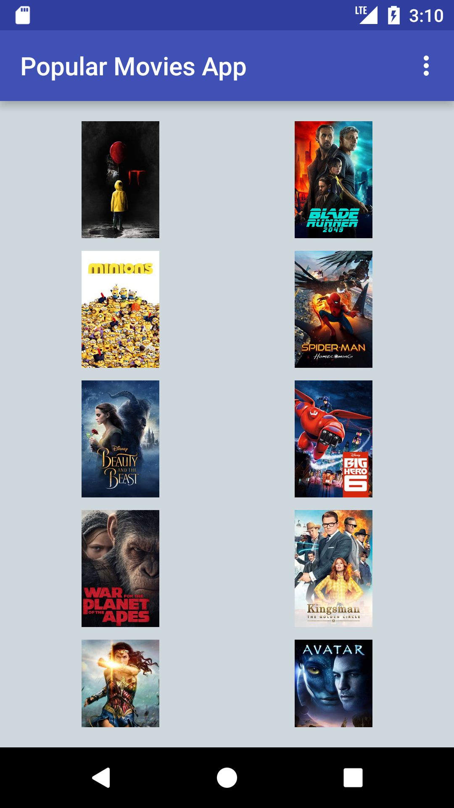
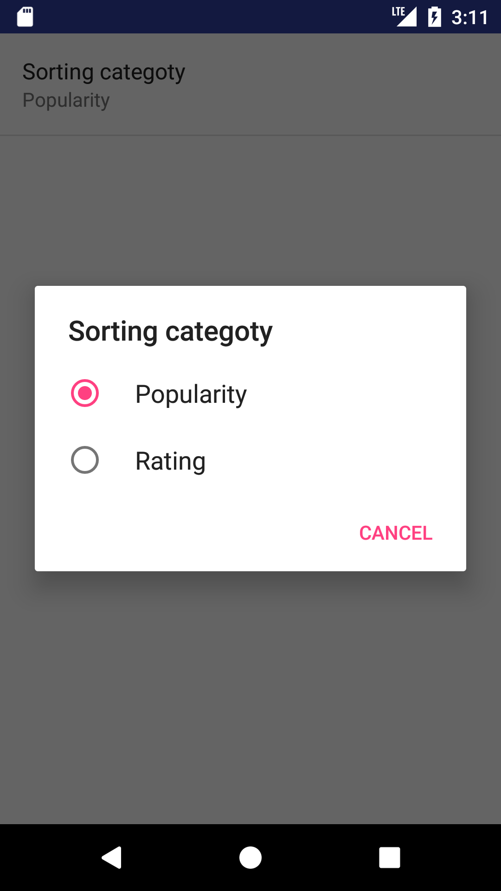

# Popular Movies App
Popular Movies is an Android App written in Java 
##### By **Katsiaryna Mashokha**
## Description
The app has the following features:
* The application presents a user with a grid arrangement of movies fetched from theMovieDB API

* The app allows a user to mark a movie as a favorite and saves it to the SQL database
* The app lets a user to play a trailer of a movie as well as read reviews and sort movies by
different criteria

* The app uses Picasso library to handle image loading and caching

## Setup/Installation Requirements
Download the following project from the gitHub by tapping "Download" or using 'git clone' from the terminal. Run it on your Android device on using the emulator.
## Support and contact details
For any concerns or questions email to: katsiarynamashokha@gmail.com

### License
Copyright (c) 2017 **_Katsiaryna Mashokha_**